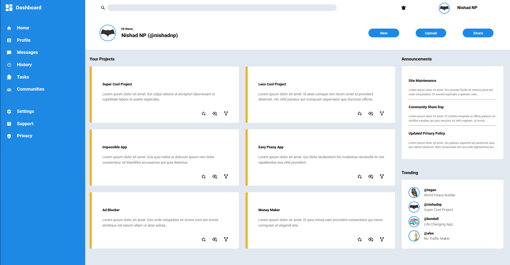

# admin-dashboard


## About 

A responsive admin dashboard built with HTML, CSS, and JavaScript. It features a sidebar navigation, cards for projects, announcements, and trending sections.

## Screenshot 


*Desktop view of the Admin Dashboard project*

## Features

- Sidebar navigation with icons.

- Header with search, notifications, and user info.

- “Your Projects” section with cards of user projects brief information and action icons.

- Announcements section with multiple broadcasts.

- Trending section with different project of different users.

- Responsive layout using Flexbox and primarily CSS Grid

## Quick Guide

- **Sidebar:** Click icons to navigate between sections.

- **Header Buttons:** Clickable notification icon. Use New”, “Upload”, and “Share” buttons for actions.

- **Your Projects:** Hover over the icons to “star”, “view”, or “fork” a project.

- **Announcements:** Read the latest updates and site messages.

- **Trending:** Hover over user projects for a visual highlight.


## Project Structure

```
admin-dashboard
├── assets/
│   ├── icons/
│   │   ├── account-box.svg
│   │   ├── community.svg
│   │   ├── eye-plus-outline.svg
│   │   ├── file-multiple.svg
│   │   ├── history.svg
│   │   ├── home.svg
│   │   ├── message.svg
│   │   ├── notification-bellring.svg
│   │   ├── privacy.svg
│   │   ├── search.svg
│   │   ├── settings.svg
│   │   ├── source-fork.svg
│   │   ├── star-plus-outline.svg
│   │   ├── support.svg
│   │   └── view-dashboard.svg
│   └── images/
│       ├── batman-symbol.png
│       ├── colorful-owl.png
│       ├── minions.png
│       ├── retro-minivan.png
│       └── screenshots/
│           └── Screenshot.png
├── css/
│   └── style.css
├── index.html
└── README.md
```

## Link 

[admin-dashboard](https://nishadnp.github.io/admin-dashboard/)